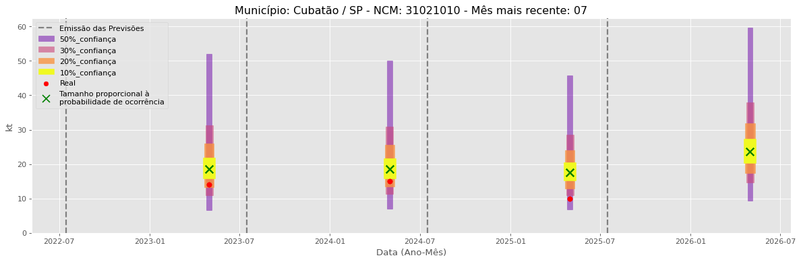
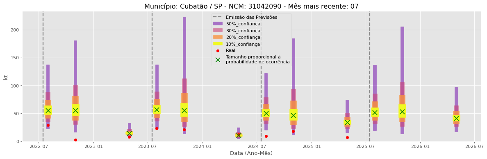

<header>
<h1><a href="https://quantimportbrazil.github.io/Sobre/">QuantImport</a></h1>
</header>

---

# Previsão de Importação - Cubatão-SP

> **Emissão:** 07-2025  
> Para fins de comparação, também apresentamos a seguir previsões e valores reais de períodos anteriores ao atual.  
> As previsões foram geradas com base em dados limitados até o mês 7.

---

**[Home](https://quantimportbrazil.github.io/Sobre/)** | **[Selecionar Estado (UF)](https://quantimportbrazil.github.io/Unidades_Federativas/)**

Fator de Influência em Destaque:
Previsões emitidas no mês 8.
Previsão Influenciada:
- Município: Cubatão
- Produto (NCM): Ureia, mesmo em solução aquosa, com teor de nitrogênio (azoto) superior a 45 %, em peso, calculado sobre o produto anidro no estado seco-31021010 
- Mês previsto: 10

Fator Influenciador: Quantidade em Comex
- Unidade Federativa: SP
- Grupo de Produto (SH2): Adubos (fertilizantes)-31 
- Mês: 1
- Unidade: sm_diff

Fator de Influência em Destaque:
Previsões emitidas no mês 8.
Previsão Influenciada:
- Município: Cubatão
- Produto (NCM): Outros cloretos de potássio-31042090 
- Mês previsto: 11

Fator Influenciador: Quantidade em Comex
- Unidade Federativa: SP
- Grupo de Produto (SH2): Sementes e frutos oleaginosos; grãos, sementes e frutos diversos; plantas industriais ou medicinais; palhas e forragens-12 
- Mês: 3
- Unidade: kt_lag13

